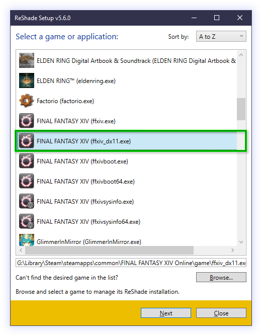
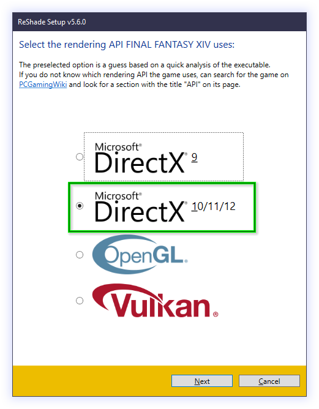

# FINAL FANTASY XIV, ISBoxer and You
_"A somewhat informative guide"_<br />


---

This guide handles the essential topics to get FINAL FANTASY XIV and XIVLauncher with Dalamud to work. The instructions here represent tsukasa's views on best practices and are not the be-all and end-all.

Also, depending on the last update date of this guide, the instructions may need to be updated, and some parts may require slightly different steps.

---


## Part I: XIVLauncher as a Launcher Replacement

[XIVLauncher][xivlauncher_github] is a popular third-party open-source launcher replacement for FINAL FANTASY XIV that comes with many improvements over Square-Enix's original game launcher, such as a "remember password" feature, an account switcher, support for both non-Steam and Steam versions and a convenient way to store patches (in case you reinstall the game, so you will not have to download 60+GB of patches again).

From a multiboxing perspective, using [XIVLauncher][xivlauncher_github] brings many advantages. It is a great boon not having to retype the password every time and not having to switch launchers because you have a Steam-bound account mixed into your character set.

---


### I.1 Adding XIVLauncher as a launcher for FINAL FANTASY XIV in Inner Space

Inner Space allows multiple profiles per game to suit different needs and use cases. A typical example of this is Blizzard's Diablo III. The game can either be started through the Battle.net Launcher or directly through the game's executable.

Starting the game through Battle.net automatically logs in the player within the game client, while directly launching the game requires the user to log in manually afterwards.

Thanks to this flexibility, we can add another profile to FINAL FANTASY XIV's game configuration to easily switch between Square-Enix's launcher and XIVLauncher while keeping it all organized under the umbrella of the game's configuration in Inner Space.

Please make sure you start Inner Space before proceeding and that FINAL FANTASY XIV has at least its Default profile in Inner Space. Also, ensure you have installed the latest version of [XIVLauncher][xivlauncher_github].

Right-click the Inner Space tray icon, select `Configuration` and switch to the `Game Configuration` tab. In the dropdown at the top, select "FINAL FANTASY XIV" from the list:


Click the `New Profile` button to add a new profile for FINAL FANTASY XIV's game configuration.

In theory, you could edit the already existing "Default" profile for the game; however, keeping the original profile intact is better if you ever want to return to a vanilla state.


Change the "New FINAL FANTASY XIV Profile" profile to something more descriptive like "FINAL FANTASY XIV XIVLauncher Profile". The profile name later identifies your XIVLauncher profile in Inner Space and ISBoxer Toolkit. Choose a description that fits the profile well.

Proceed to set `Main executable filename` from "NULL" to "XIVLauncher.exe".

Now open a file manager like Windows Explorer and navigate to `%LOCALAPPDATA%\XIVLauncher`. This path should resolve to an absolute path like `C:\Users\YourUsername\AppData\Local\XIVLauncher`. Copy the actual path from the address bar of your file manager, and set it as the `Main executable path` in the dialogue.

> __❗ Note:__ We cannot directly use environment variables like `%LOCALAPPDATA%` in Inner Space's Game Configuration, so we must manually resolve the path. Do not simply copy & paste the `%LOCALAPPDATA%\XIVLauncher` into the `Main executable path` - this will _not_ work!

Ensure the `Inner Space Loader aggressiveness` is set to "Default" or "Standard". In the past, a value of "Minimum" was required. However, changed software behaviour has adverse effects when using "Minimum" today (causing Inner Space to "lose" the game's process).

Therefore, older setups from spring 2022 or earlier may have stopped working. In that case, you might need to manually revert the `Inner Space Loader aggressiveness` back to "Default" or "Standard".

Your configuration should look something like this:


You can safely ignore the other values in the dialogue.

Click the `Apply` button in the lower right corner and close the profile with the `Close Profile` button in the middle afterwards.

You should be back in the dialogue that allows you to select profiles for FINAL FANTASY XIV. If you click on the list below the `New Profile` button, your newly created profile "FINAL FANTASY XIV XIVLauncher Profile" should be listed.

Click the `Reload` button on the lower left to ensure the changes propagate correctly in Inner Space. Otherwise, you might see a wrong name in ISBoxer Toolkit later on.


#### Short Summary
- Create a new FINAL FANTASY XIV game profile in Inner Space.
- Point the executable to XIVLauncher.
- Ensure `Inner Space Loader aggressiveness` is set to "Default".

---


### I.2 Un-sandboxing Steam for Steam-bound FINAL FANTASY XIV Accounts

This section is only necessary if you have a mix of regular service accounts and __exactly one__ Steam-connected account.

You can skip this section if you either __do not use__ a Steam-connected service account or use __multiple__ Steam-connected service accounts.

By default, Inner Space sandboxes Steam processes to allow multiboxing with multiple Steam accounts/sessions running simultaneously. The sandboxing is a nice feature, however inconvenient in a FINAL FANTASY XIV multiboxing setup where you have four service accounts and only one is connected to Steam, causing you hassle in XIVLauncher.

Following the instructions in this section will selectively un-sandbox XIVLauncher from Inner Space's Steam virtualization so you can have your regular Steam session running on your desktop and use it to authenticate against the XIVLauncher version running within Inner Space.

> __❗ Note:__ It is prudent to set up `unsteam.iss` on a per-profile basis to ensure that you only un-sandbox particular games/profiles while keeping the general Steam sandboxing within Inner Space intact.

> __❗ Note:__ If you are using __multiple__ Steam-connected FINAL FANTASY XIV accounts and are still reading this, you should _really_ skip this section. Un-sandboxing is only viable when using __exactly__ one Steam account.

First, you need to download the [unsteam.iss][unsteam_iss_script] script. Copy the script to your ISBoxer's `Script` directory.

Now right-click the Inner Space tray icon, select `Configuration`, switch to the `Game Configuration` tab and select "FINAL FANTASY XIV" from the list of games. Choose your "FINAL FANTASY XIV XIVLauncher Profile" from the list of profiles you created during chapter I.1.


Click the `Startup` button. In the "Startup" dialogue, click the `Insert` button to create a "New Entry" in the action list on the left. Click the "New Entry" and edit its name on the right.

Set the name to "Remove Steam Redirects" and set the `Command to execute at this step of the sequence` to "waitscript unsteam".


Once you have made the edits, click the `Finished` button to return to the previous dialogue. Click the `Apply` button in the lower right, the `Close Profile` button in the middle and then the `Reload` button in the lower left.

Your XIVLauncher profile should now be un-sandboxed. You can later check this by opening the Inner Space in-game console within a running character session and looking for the `[UnSteam]` log entries.

#### Short Summary
- Download [unsteam.iss][unsteam_iss_script] and put it into ISBoxer's `Script` directory.
- Add a `Startup` sequence entry for your "FINAL FANTASY XIV XIVLauncher Profile" with `waitscript unsteam`.

---


### I.3 ISBoxer Toolkit: Configuring your Characters

With Inner Space now having a XIVLauncher profile for FINAL FANTASY XIV, we can continue configuring our characters in ISBoxer Toolkit to use the alternate launcher.

Start ISBoxer Toolkit, navigate to `ISBoxer - Characters - YOUR CHARACTER` and change the `Game Profile` to your newly created "FINAL FANTASY XIV XIVLauncher Profile". Repeat this for all relevant characters.


Once done, save the profile (File - Save) and export it to Inner Space (File - Export All to Inner Space).

#### Short Summary
- Set the `Game Profile` for your FINAL FANTASY XIV characters in ISBoxer Toolkit to "FINAL FANTASY XIV XIVLauncher Profile".

---


### I.4 XIVLauncher Configuration

You added XIVLauncher as a game profile for FINAL FANTASY XIV in Inner Space in the previous steps. You configured your characters to use XIVLauncher instead of Square-Enix's regular launcher.

Currently, the configuration uses the same XIVLauncher data directory as your regular XIVLauncher. There is no distinction between a regular XIVLauncher session outside of Inner Space and a XIVLauncher session inside Inner Space.

> __❗ Note:__ This means that every configuration change you make in a XIVLauncher session started through Inner Space will also affect your "regular" XIVLauncher. An example of how to fan out XIVLauncher's data directories on a per-character basis to sidestep this behaviour is available in chapter III.1 of this guide.

Start your first character slot via Inner Space. XIVLauncher should start. If that is not the case, please review the earlier steps and ensure all paths are correct.

Once XIVLauncher has fully loaded, please open the settings via the icon on the main screen:


Make sure you are using DirectX 11:


DirectX 9 [is no longer supported in FINAL FANTASY XIV][ffxiv_dx9_eol_lodestone]. The game still allows you to play in DirectX 9, but Inner Space might not work correctly.

Disable Dalamud injection, as this causes the spawned game client process to be "missed" by Inner Space:


> __❗ Note:__ This section aims to use XIVLauncher as an alternate launcher. Please see the next chapter if you want to use Dalamud with Inner Space.

Once you have finished configuring XIVLauncher, confirm the settings and perform a log-in with it.

If you are using Steam, please follow the steps to disable sandboxing/virtualization of Steam in chapter I.2, tick the `Use Steam service account` checkbox in the main window and have your Steam client running in the background.

The game should launch, and Inner Space should apply ISBoxer's window layout for your character set.

If that is not the case, please review the previous steps.

#### Short Summary
- Make sure XIVLauncher will start the game in DirectX 11 and Dalamud is disabled.

---


## Part II: Dalamud

[Dalamud][dalamud_github] is an unofficial third-party open-source plugin framework for FINAL FANTASY XIV that enables users to augment their game with many quality-of-life enhancements. There is an active debate about what enhancement level is a quality-of-life change and what could already be considered an "unfair advantage".

This discussion is not the primary focus of this part. However, the open-source nature of Dalamud enables everyone to build unofficial plugins, some of which fall into the realm of cheating and excessive automation.

Culling the entire discussion about Dalamud because of this facet would be hasty, though, as many of the "official" plugins available from the Dalamud Plugin Installer are minor tweaks to the UI the player base has begged Square-Enix for and have no impact on practical gameplay.

As with all third-party tools, using Dalamud is prohibited under Square-Enix's terms of service. Please be aware of this fact.

> __❗ Note:__  Winners do not automate but use mapped keys!

---


### II.1 Dalamud and Inner Space

Using XIVLauncher to inject Dalamud into the game causes Inner Space to lose access to the game client's process (after summer 2022). Previous chapters have instructed you to disable Dalamud injection in XIVLauncher to circumvent this issue.

Because we want to use Dalamud, Inner Space will need to work for us and take the role of the injector.

The basic idea is to use a LavishScript session script that will inject Dalamud for you:
- Construct a JSON payload in LavishScript that contains all the start and session parameters for Dalamud.
- Set the JSON payload as an environment variable within the current scope, making it easily accessible.
- Inject a modified version of Dalamud's `Dalamud.Boot.dll` called `Dalamud.EasyBoot.dll` that reads the JSON from the environment variable and performs the rest of the injection, same as the regular `Dalamud.Boot.dll`.

Dalamud also supports injection through the `Dalamud.Injector.exe` that ships with the software. However, while it is easy to build the necessary arguments to call the injector executable from within your Inner Space session, the use of the executable will break certain Inner Space features, such as file virtualization, causing conflicts when multiple clients are trying to update/access, i.e. the `ffxiv.cfg` file.

Unfortunately, this behaviour is due to the "BootEnabledGameFixes" configuration parameter that is hard-coded into the `Dalamud.Injector.dll`. A few of these fixes override Inner Space's Windows API hooks, thus effectively disabling, for instance, file virtualization.

For this reason, the Dalamud.EasyBoot.dll injection method is the easiest, most reliable and fastest way to load Dalamud into a game process managed by Inner Space.

> __❗ Note:__ This part of the guide describes how to inject Dalamud. There is an issue with inputs within Dalamud's ImGui not being recognized. If you are not using an Inner Space development build newer than 7165 with the new input system enabled, then this issue requires a more sophisticated setup where every character has its own XIVLauncher/Dalamud data directory. An example of how to fan out XIVLauncher/Dalamud's data directories on a per-character basis to sidestep this behaviour is available in chapter III.1 of this guide.

So how exactly do you set up the script?

You will need to download two files:
- The [ffxiv-utils.iss LavishScript][ffxiv_utils_iss] itself.
- The [Dalamud.EasyBoot.dll][dalamud_easyboot_dll] ([Source-code on GitHub][dalamud_easyboot_dll_source]) that will handle the actual injection.

Put these files into the `init-session` folder in your ISBoxer `Scripts` directory. If the `Scripts/init-session` folder does not exist, please create it.


Scripts put into this folder are automatically executed by Inner Space once a session starts, so you don't need to manually add additional pre-startup or startup sequence entries to Inner Space like you might have had to do with the `unsteam.iss` script.

Open `ffxiv-utils.iss` in a text editor of your choice and set the value of the variable `injectDalamud` at the top of the file to `TRUE`. Setting the variable to `TRUE` configures the script to inject Dalamud once the FINAL FANTASY XIV game client runs within Inner Space.

You can ignore the rest of the settings for now.

Launch a character from your character set and log into the game. Upon zoning into the game world, you should see the Dalamud messages in your chat window.

As mentioned before, in this configuration, Dalamud is operational. If you are using an Inner Space version newer than 7165 with the new input system enabled, then you are set.

Otherwise, inputs in the GUI elements of Dalamud are not recognized due to the changes made on the ImGuiScene library with [this commit in mid-2022][imguiscene_goat_wndproc_commit_github] that somehow ended up breaking the inputs while running within Inner Space with Inner Space's old input system.

If you want the inputs to work on older Inner Space versions or the old input system, you must ensure that every character has its own XIVLauncher/Dalamud data directory because the current workaround involves replacing a DLL file before loading Dalamud. Since the Dalamud assets are automatically checked and updated by XIVLauncher during every application start, this operation will fail when multiple characters try to access a single data directory due to locking issues.

#### Short Summary
- Download [ffxiv-utils.iss][ffxiv_utils_iss] and [Dalamud.EasyBoot.dll][dalamud_easyboot_dll].
- Place both in ISBoxer's `Scripts/init-session` directory.
- Edit `ffxiv-utils.iss` and set variable `injectDalamud` to `TRUE`.

---


### II.2 Troubleshooting

If you can see the Dalamud chat messages but executing `/xlplugins` shows no window, please check whether you have a post-processor like ReShade or GShade installed and remove the post-processor from the game's directory. This issue usually happens when a post-processor is installed as `dxgi.dll` in the game's directory.

If you suspect a problem, please set an in-game console hotkey for your character set via ISBoxer Toolkit:


By bringing up the Inner Space console in-game, you can check whether the `ffxiv-utils.iss` script has ended prematurely due to a known error condition or everything looks good:


(This is a case of "looks good" because no messages are beginning with `Error`)

You might need to scroll up in the console before reaching the log messages prefixed `[FFXIV Utils]`. Error messages are prefixed with a clear `Error:` and should explain why.

If you cannot make heads or tails of the log, feel welcome to join the [ISBoxer Discord's][isboxer_discord] #final_fantasy_xiv channel, where you can draw from the community's combined well of knowledge.

---


# Part III: Advanced Setup

Up to this point, you have produced a clean and simple setup. But you want more flexibility and fewer caveats. You want to have individual configurations for XIVLauncher for all your characters. And you want inputs in Dalamud's GUI.

You want to ensure that individual files like databases or configuration files of plugins running simultaneously across multiple characters stay intact and separate.

In the past, you could have added three more XIVLauncher game profiles to Inner Space's FINAL FANTASY XIV configuration and used the command line argument `--roamingPath=C:/XIVLauncherData/character1` to specify the data directory for each character.

This method still does work for XIVLauncher - but not for Dalamud. Because the injection cannot happen through XIVLauncher anymore, the information about the data directory must be passed to Dalamud differently.

It is also an inelegant solution to add multiple nearly identical game profiles because changes to that profile must be replicated numerous times across all profiles.

This part of the guide will:
- Alter the startup sequence for XIVLauncher to enable the easy configuration of character-specific environment variables.
- Add support for replacing the `ImGuiScene.dll` to enable inputs in Dalamud while running within Inner Space with the old input system.
- Add ReShade as a post-processor.

---


### III.1 Preparing a Replacement for XIVLauncher's Startup Sequence

One solution for an alternate startup sequence proposed by tsukasa is the "batch voodoo" solution.

It consists of one core file and a variable number of copies of another.

The general principle behind the batch voodoo is to call the central batch file `XIVLauncher.cmd` that contains details about the available paths and environment (i.e. the path that houses all character-specific data, the install location of XIVLauncher etc.).

The `XIVLauncher.cmd` then calls upon the `XIVLauncher-env.cmd`. We will configure this file to be virtualized in ISBoxer Toolkit to return a character-specific copy, thus allowing you to set variables on a per-character basis without adding multiple game profiles in Inner Space.

The `XIVLauncher.cmd` will set an environment variable that will be picked up by the `ffxiv-utils.iss` we set up earlier and start the regular XIVLauncher. If the environment variable is present and the directory referenced in it exists, `ffxiv-utils.iss` will use this directory and pass the information on to Dalamud, thus giving you the per-character separation you want. Otherwise, `ffxiv-utils.iss` will fall back on the regular data path in `%APPDATA%\XIVLauncher`.

To start, you must download the batch files you want to use as the alternate startup sequence. You can grab the [latest version from GitHub][tsukasa_batch_files_github] by following the link, clicking the green `Code` button in the upper right corner and selecting `Download ZIP`.

Extract the files `XIVLauncher.cmd` and `XIVLauncher-env.cmd` to an empty directory (i.e. `G:\Multiboxing\XIVLauncherBatch`) that will only house these files, including their character-specific copies.

Please ensure that the directory does not contain any funny characters or spaces. A bland, short path without spaces works best.

Right-click the `XIVLauncher.cmd` and select `Edit`.

There is a large configuration block at the top of the file. You only need to adjust one setting, though.

Edit the `ROAMINGPATH_ROOT` (Root directory for character/character set-specific data). Set this path to point at an empty directory that will house your character-specific data later.

As with the directory for the two batch files, a dull, short path with no funny characters or spaces is recommended because the scripting has yet to be tested against the scenarios mentioned above.

Please save the file and close it.

Now start ISBoxer Toolkit, navigate to `ISBoxer - Virtual Files`, right-click the `Virtual Files` node and select `New Virtual File` from the context menu. Name the file "XIVLauncher-env.cmd".


Select your first character from `ISBoxer - Characters - CHARACTER NAME`, select the `Virtual Files` node in the lower treeview and enable the "XIVLauncher-env.cmd" from the list.

Repeat this for all relevant characters.

Select the first character again and go to `ISBoxer - Virtual Files - XIVLauncher-env.cmd` in the lower treeview. Virtualize the file as "XIVLauncher-env-CUSTOMNAME.cmd" where "CUSTOMNAME" is a string (i.e. the first name of the character without any special characters or spaces).


The file name must follow this specific static schema. Because the character name is determined from the filename, prepending character names or completely different filename schemas will break the mechanism.

```
XIVLauncher-env-CUSTOMNAME.cmd
`------.------´ `----.---´ `.´
       |             |      |
  Static part   Char name  Ext
```

You _can_ make other schemas work if you know your way around batch files. However, for the sake of this guide, we will keep it as simple as possible. If you are interested in making other schemas work, check the `XIVLauncher-env.cmd` contents for more details on how it functions.

Repeat these steps for all other relevant characters.

Open your file manager and create copies of the `XIVLauncher-env.cmd` file. You copy the file and paste it into the same directory as the two files `XIVLauncher.cmd` and `XIVLauncher-env.cmd`.

Rename it to `XIVLauncher-env-CUSTOMNAME.cmd`, where `CUSTOMNAME` is the alias of a file we specified for one of our characters in the ISBoxer Toolkit.

Repeat this step for all relevant characters (i.e. `XIVLauncher-env-Lax.cmd`, `XIVLauncher-env-MiRai.cmd`, `XIVLauncher-env-altbob.cmd` and `XIVLauncher-env-Svpernova09.cmd`).

> __❗ Note:__ Make sure you are mindful about your file manager's setting for displaying/hiding the file extension. The file has to be called `XIVLauncher-env-ALIAS.cmd`, not `XIVLauncher-env-ALIAS.cmd.cmd` or `XIVLauncher-env-ALIAS`.

The file virtualization will force `cmd.exe` to redirect the execution of `XIVLauncher-env.cmd` to one of your character-specific files once you launch this character through Inner Space. The batch file will be able to determine its name and set the character name, which will then be picked up by `XIVLauncher.cmd` to build its arguments and environment variables.

The last step is to alter the XIVLauncher game profile for FINAL FANTASY XIV in Inner Space. For this, right-click the Inner Space tray icon, select `Configuration`, navigate to the `Game Configuration` tab, select "FINAL FANTASY XIV" from the game list and pick the "FINAL FANTASY XIV XIVLauncher Profile" from the game profile list.

You are in the dialogue showing us the `Main executable filename` as "XIVLauncher.exe" and `Main executable path` as whatever path you chose before:


Adjust the `Main executable filename` to "XIVLauncher.cmd" and set the `Main executable path` to whatever directory you have extracted the two batch files.


Click `Apply` to save the changes, `Close Profile` to close the dialogue and `Reload` to propagate the settings in Inner Space.

Then proceed to launch a character from your character set. Instead of bringing up the XIVLauncher main window, the launcher should guide you through its first-time configuration wizard, where you have to specify the game path, language, DirectX version to use and whether you want to enable Dalamud (Please disable Dalamud here!).

The aforementioned first-time configuration wizard should launch for all of your characters. You should also notice that you now find folders corresponding to your character names in your configured path (i.e. `G:\Multiboxing\XIVLauncherData`).

Please review the previous steps if you need a character name or if XIVLauncher did not jump into the first-time configuration wizard.

Otherwise, your XIVLauncher and Dalamud data directories are now successfully set on a per-character basis.

You can verify this by logging into the game client and checking the Inner Space in-game console. You will see that `ffxiv-utils.iss` picks up the character-specific path.

#### Short Summary
- Download [batch voodoo][tsukasa_batch_files_github].
- Place in an empty directory and edit `XIVLauncher.cmd` to adapt your paths.
- Create new `Virtual Files` for `XIVLauncher-env.cmd` in ISBoxer Toolkit and assign them to characters.
- Create copies of `XIVLauncher-env.cmd` and rename them according to the rules from ISBoxer Toolkit.
- Alter "FINAL FANTASY XIV XIVLauncher Profile" in Inner Space, point it to `XIVLauncher.cmd`.

---


### III.2 Enabling ImGuiScene Replacement

As noted earlier, inputs in Dalamud's ImGui are not processed while running under Inner Space's old input system [due to changes made][imguiscene_goat_wndproc_commit_github] to `ImGuiScene.dll` in mid-2022.

As a user, you have two options:
- Use an Inner Space build >= 7165 and enable the new input system.
- Use a patched version of the ImGuiScene.dll and have ffxiv-utils.iss replace the DLL file on every start.

This chapter will describe the second option.

Since XIVLauncher checks and restores Dalamud installations on every application launch, the replacement will occur every time you launch the game through Inner Space.

> __❗ Note:__ This workaround requires that you have per-character XIVLauncher/Dalamud data folders. If you have skipped the previous chapter, you will run into issues when launching more than one character.

To enable this feature, download the [patched ImGuiScene.dll][imguiscene_patched_dll] ([Source-code on GitHub][imguiscene_patched_source_github]) and put it in ISBoxer's `Scripts/init-session` folder, right where the `ffxiv-utils.iss` and `Dalamud.EasyBoot.dll` already exist.

Edit the `ffxiv-utils.iss` in a text editor and change the variable `replaceImGuiSceneDll` value in the configuration block at the top of the file from `FALSE` to `TRUE`.

Once the game client has launched, the `ImGuiScene.dll` in your character's latest Dalamud version folder should automatically get replaced with a patched copy from the `init-session` folder right before `ffxiv-utils.iss` injects Dalamud into the game.

The operation should produce log entries in Inner Space's in-game console.

Dalamud's GUI should recognize and process your inputs once again if the replacement succeeds.

#### Short Summary
- Download [patched ImGuiScene.dll][imguiscene_patched_dll] and place in the same directory as `ffxiv-utils.iss`.
- Edit `ffxiv-utils.iss` and set variable `replaceImGuiSceneDll` to `TRUE`.

---


### III.3 Enabling ReShade

[ReShade][reshade] is a popular open-source post-processing injector that will allow you to apply ambient occlusion, real depth of field effects, colour correction, and more.

Using Dalamud and setting up ReShade without proper setup can lead to problems with Dalamud's GUI being invisible. This chapter deals with the proper configuration.

> __❗ Note:__ This guide only deals with how to install ReShade. Installing shaders/presets or migrating from GShade is _not_ part of this guide. For details, please see a migration guide like [this one][reshade_migration_guide].

Download [ReShade from the official website][reshade]. Make sure you download the version with full add-on support.

Execute the installer and select your "ffxiv_dx11.exe". If the game executable cannot be found in the list, click the `Browse` button and select it manually.



Click the `Next` button and select `DirectX 10/11/12` from the list.



Proceed with the rest of the setup as you see fit.

Once the installer exits, open your FINAL FANTASY XIV folder in a file manager, browse to the `game` subfolder, and rename the `dxgi.dll` in that folder to `dinput8.dll`.

When ReShade is found as `dxgi.dll`, special compatibility functions in Dalamud kick in. These functions break with Inner Space, so we rename the ReShade DLL file to something not subject to Dalamud's checks.

ReShade and Dalamud should work fine together now.

#### Short Summary
- Download ReShade with full addon support.
- Install for DirectX 10/11/12.
- Rename `dxgi.dll` in FINAL FANTASY XIV's game directory to `dinput8.dll`.

---


[dalamud_easyboot_dll_source]: https://github.com/LaxLacks/Dalamud
[dalamud_easyboot_dll]: /assets/Dalamud.EasyBoot.dll
[dalamud_github]: https://github.com/goatcorp/Dalamud/
[ffxiv_dx9_eol_lodestone]: https://eu.finalfantasyxiv.com/lodestone/news/detail/46f28ce6bd697e3fd08e0e70c3c7646e5f5a3385
[ffxiv_utils_iss]: /scripts/ffxiv-utils.iss
[imguiscene_goat_wndproc_commit_github]: https://github.com/goatcorp/ImGuiScene/commit/83de2a3d4f4b52ab05ec161dc08c915f07f3f3e0
[imguiscene_patched_dll]: /assets/ImGuiScene.dll
[imguiscene_patched_source_github]: https://github.com/tsukasa/ImGuiScene
[isboxer_discord]: https://discord.gg/ESxEzhs
[tsukasa_batch_files_github]: https://github.com/tsukasa/isboxer_ffxiv_batch
[unsteam_iss_script]: /scripts/unsteam.iss
[xivlauncher_github]: https://github.com/goatcorp/FFXIVQuickLauncher
[reshade]: https://reshade.me
[reshade_github]: https://github.com/crosire/reshade
[reshade_migration_guide]: https://gist.github.com/ry00001/3e2e63b986cb0c673645ea42ffafcc26
