# FINAL FANTASY XIV, ISBoxer and You
_"A somewhat informative guide"_ 

---

This guide handles the basic topics to get FINAL FANTASY XIV and XIVLauncher with Dalamud to work. The instructions here represent tsukasa's own views/best practices and are by no means the be-all and end-all.

---

## Part I: XIVLauncher as a Launcher Replacement

[XIVLauncher][xivlauncher_github] is a popular third-party open-source launcher replacement for FINAL FANTASY XIV that comes with many improvements over Square-Enix's original game launcher such as a "remember password" feature, an account list, support for both non-Steam and Steam versions and a convenient way to store patches (in case you reinstall the game, so you will not have to download 60+GB of patches again).

From a multiboxing perspective, using [XIVLauncher][xivlauncher_github] has many advantages. Not having to retype the password every time, and not having to switch launchers because you have a Steam-bound account mixed in, is a great boon.

### I.I Adding XIVLauncher as a launcher for FINAL FANTASY XIV in Inner Space

Inner Space allows multiple profiles per game. A typical example for this is Blizzard's Diablo III that can either be started through the Battle.net Launcher or directly. Starting the game through Battle.net automatically logs-in the player in the game client, while starting the game client directly requires the user to perform the log-in manually.

Thanks to this flexibility, we are able to add another profile to FINAL FANTASY XIV's game configuration to easily switch between Square-Enix's launcher and XIVLauncher while keeping it all organized within the game configuration of FINAL FANTASY XIV.

Make sure Inner Space is started before proceeding and that FINAL FANTASY XIV has at least its Default profile in Inner Space. Also make sure you have installed the latest version of [XIVLauncher][xivlauncher_github].

Right-click the Inner Space tray icon, select `Configuration` and switch to the `Game Configuration` tab. In the dropdown at the top, select FINAL FANTASY XIV from the list:

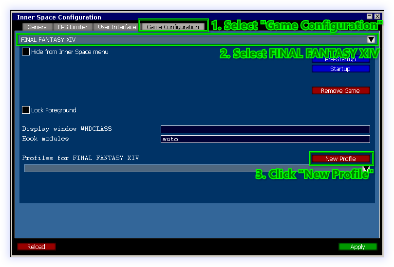

Click the "New Profile" button to add a new profile for FINAL FANTASY XIV's game configuration. You will be able to select which profile to use on a per-character basis in ISBoxer Toolkit.

In theory you could edit the already existing Default profile for the game, however it is better to keep the original profile intact in case you ever want to go back to a vanilla configuration.

You will find yourself in what could be perceived as a somewhat daunting dialogue:

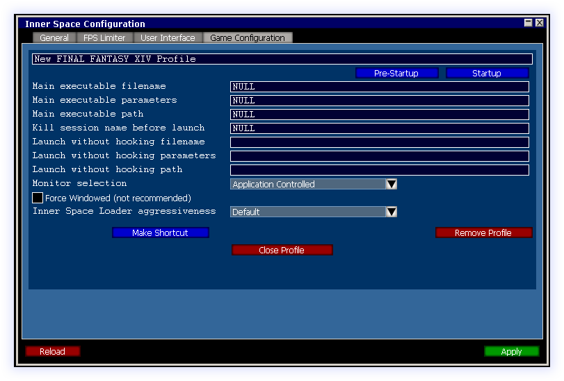

Change the "New FINAL FANTASY XIV Profile" to something more descriptive like "FINAL FANTASY XIV XIVLauncher Profile". This is the title that later identifies your XIVLauncher profile in Inner Space and therefore ISBoxer Toolkit, so choose a name that you can make sense of.

Proceed to set `Main executable filename` from "NULL" to "XIVLauncher.exe".

Now open a file manager like Windows Explorer and navigate to `%LOCALAPPDATA%\XIVLauncher`. This should resolve to a path like `C:\Users\YourUsername\AppData\Local\XIVLauncher`. Copy the path from the address bar of your file manager, and set it as the `Main executable path` in the dialogue.

> __❗ Note:__ We cannot use environment variables like `%LOCALAPPDATA%` in Inner Space's Game Configuration directly, so we need to manually resolve the path first. Do not simply copy & paste the `%LOCALAPPDATA%\XIVLauncher` into the `Main executable path` - this will _not_ work!

Make sure the `Inner Space Loader aggressiveness` is set to `Default` or `Standard`. In the past a value of `Minimum` was required, however due to changing software behaviour this has adverse effects today (causing Inner Space to "lose" the game's process). It is therefore possible that on older setups that seemingly no longer work correctly, you might need to manually revert to `Default` or `Standard`.

Your configuration should look something like this:

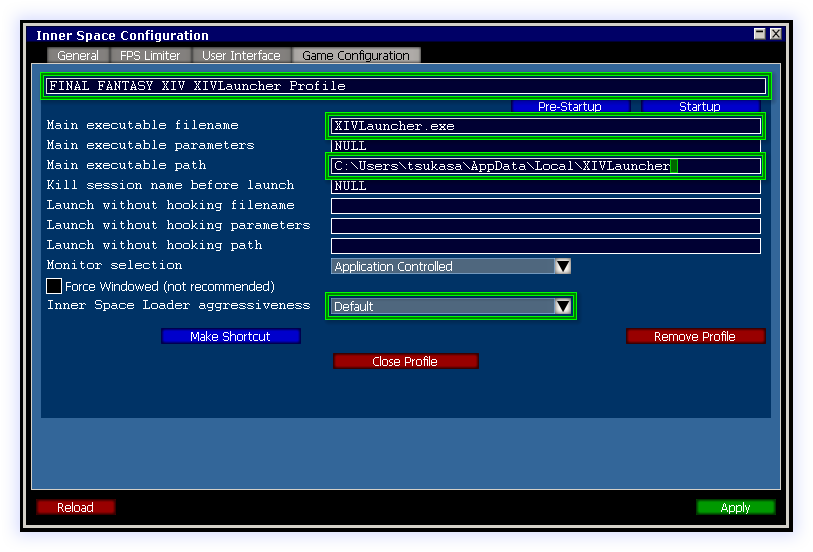

You can safely ignore the other values in the dialogue.

Click the `Apply` button in the lower right corner and close the profile with the `Close Profile` button in the middle afterwards.

You should be back in the dialogue that allows you to select profiles for FINAL FANTASY XIV. If you click on the list below the `New Profile` button, your newly created profile `FINAL FANTASY XIV XIVLauncher Profile` should now be listed.

Click the `Reload` button on the lower left to make sure the changes propagate properly in Inner Space, otherwise you might see a wrong name in ISBoxer Toolkit later on.

### I.II Un-sandboxing Steam for Steam-bound FINAL FANTASY XIV Accounts

This section is only necessary if you have a mix of regular service accounts and __exactly one__ Steam-connected account.

If you use __no__ Steam-connected service account or __multiple__ Steam-connected service accounts, you can skip this section.

Inner Space, by default, sandboxes Steam processes to allow multiboxing with multiple Steam accounts. This is a nice feature, however slightly annoying in a FINAL FANTASY XIV multiboxing setup where you have 4 service accounts but only one of them is connected to Steam, causing you errors in XIVLauncher because of the sandboxing.

Following the instructions in this section will selectively un-sandbox XIVLauncher from Inner Space's Steam virtualization so you can have your regular Steam session running on your desktop and have it authenticate against the XIVLauncher version running within Inner Space.

> __❗ Note:__ If you are using __multiple__ Steam-connected FINAL FANTASY XIV accounts and are still reading this, you should _really_ skip this section. Un-sandboxing is only a viable way when using __exactly__ one Steam account.

First, you need to download the [unsteam.iss][unsteam_iss_script] script. Copy the script to your ISBoxer's `Script` directory.

Now right-click the Inner Space tray icon, select `Configuration`, switch to the `Game Configuration` tab and select FINAL FANTASY XIV from the list of games. From the list of profiles, select your "FINAL FANTASY XIV XIVLauncher Profile" that you created during I.I.

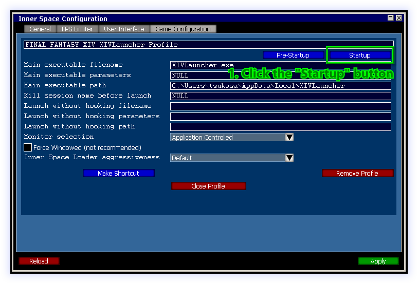

In the "Startup" dialogue, click the `Insert` button. This generates a "New Entry" in the action list on the left. Click the "New Entry" and edit its name on the right.

Set the name to "Remove Steam Redirects" and set the "Command to execute at this step of the sequence" to `waitscript unsteam`.

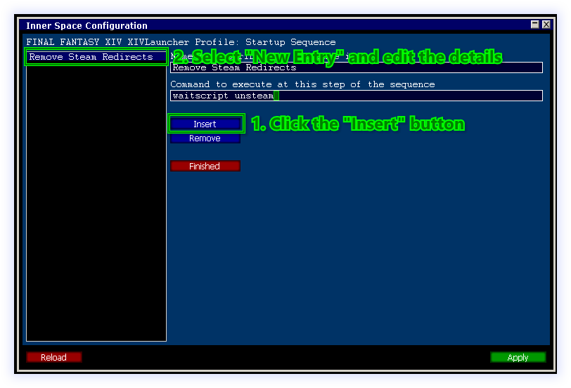

Once you have made the edits, click the `Finished` button. This should take you back to the previous dialogue. Click the `Apply` button in the lower right, the `Close Profile` button in the middle and then the `Reload` button in the lower left.

Your XIVLauncher profile should now be un-steamed, causing the virtualization/sandboxing of Steam to be lifted for this specific game profile in Inner Space. You can later check this by opening the Inner Space in-game console within a running character session and look for the `[UnSteam]` log entries.

### I.III ISBoxer Toolkit: Configuring your Characters

With Inner Space now having a XIVLauncher profile for FINAL FANTASY XIV, we can move on to configuring our characters in ISBoxer Toolkit to actually make use of the launcher.

Start ISBoxer Toolkit, navigate to ISBoxer - Characters - YOUR CHARACTER and change the `Game Profile` to your newly created "FINAL FANTASY XIV XIVLauncher Profile". Repeat this for all relevant characters.

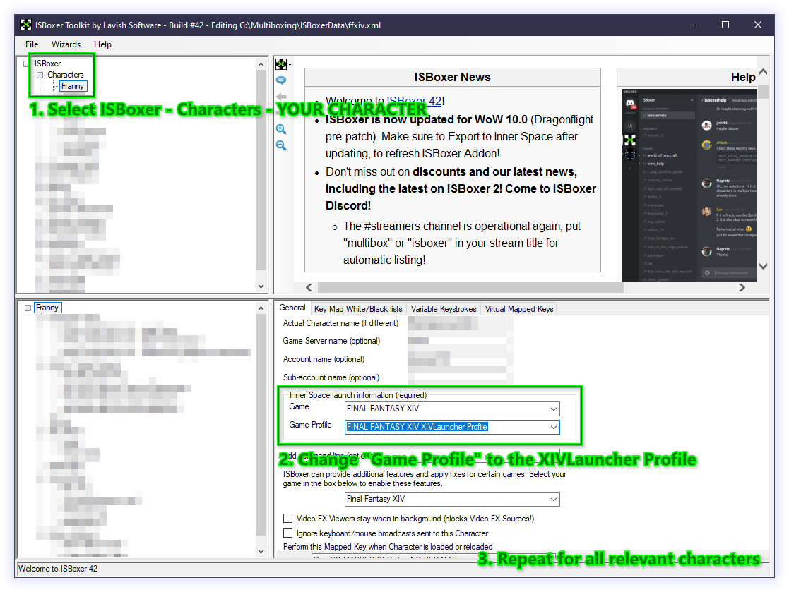

Once you are done, save the profile (File - Save) and export it to Inner Space (File - Export All to Inner Space).

### I.IV XIVLauncher Configuration

In the previous steps we have added XIVLauncher as a game profile for FINAL FANTASY XIV in Inner Space and configured our characters to use XIVLauncher instead of Square-Enix's regular launcher.

At this point the configuration uses the same XIVLauncher data directory as your regular XIVLauncher, meaning there is no distinction between a regular XIVLauncher session outside of Inner Space and a XIVLauncher session in Inner Space.

> __❗ Note:__ This means that every configuration change you make in a XIVLauncher session started through Inner Space will also affect your "regular" XIVLauncher. An example how to fan out XIVLauncher's data directories on a per-character basis to sidestep this behaviour is included in a later section of this guide.

Start your first character via ISBoxer. XIVLauncher should start. If that is not the case, please review the earlier steps and ensure all paths are correct.

Once XIVLauncher has fully loaded, please open the settings via the icon on the main screen:

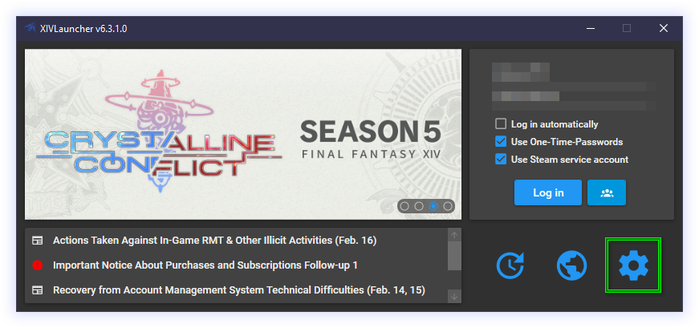

Make sure you are using DirectX 11:

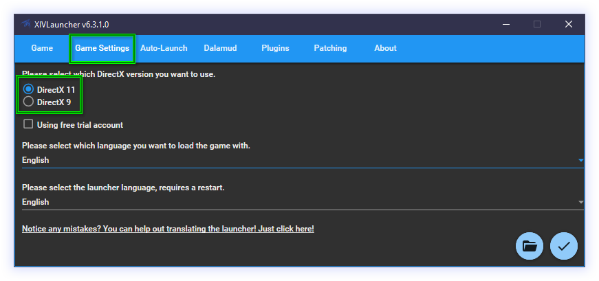

DirectX 9 [is no longer supported in FINAL FANTASY XIV][ffxiv_dx9_eol_lodestone] and while the game still allows you to play in DirectX 9, Inner Space might not work correctly.

Make sure to disable Dalamud injection, as this causes the spawned game client process to be "missed" by Inner Space:

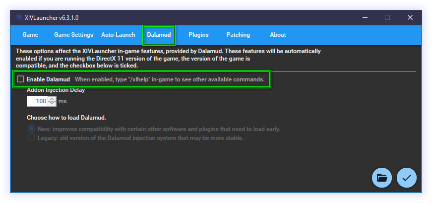

> __❗ Note:__  The goal of this section is to use XIVLauncher as an alternate launcher, if you are interested in using Dalamud with Inner Space, please see the next chapter.

Once you have finished configuring XIVLauncher, confirm the settings and perform a login with XIVLauncher.

If you are using Steam, please make sure you followed the steps to disable sandboxing/virtualization of Steam in chapter I.II, to tick the `Use Steam service account` checkbox in the main window and have your Steam client running in the background.

The game should launch and Inner Space should apply ISBoxer's window layout for your character set.

If that is not the case, please review the previous steps.

---

## Part II: Dalamud

Dalamud is an unofficial third-party open-source plugin framework for FINAL FANTASY XIV that enables users to augment their game with many quality of life enhancements. There is an active debate about what level of enhancement is a quality of life change and what could already be considered an "unfair advantage".

This discussion is not the primary focus of this part, however please keep in mind that the open-source nature of Dalamud has enabled unofficial/unlisted plugins that clearly fall into the realm of cheating and should be avoided. Culling the entire discussion about Dalamud would be hasty, though, as many of the official tweaks available from the Dalamud Plugin Installer have been begged for by the playerbase for years and have no impact on practical gameplay.

As with all third-party tools, the use is forbidden by Square-Enix's terms of service. Please be aware of this fact, if you wish to use Dalamud.

### II.I Dalamud and Inner Space

Since Dalamud cannot be injected through XIVLauncher anymore without Inner Space losing access to the game client's process (after summer 2022), we have disabled Dalamud in XIVLauncher during the configuration of the launcher in the previous chapter.

The basic idea is to have a LavishScript session script that will perform the injection of Dalamud for us:
- Construct a JSON payload in LavishScript that contains all the start and session parameters for Dalamud.
- Set the JSON payload as an environment variable within the current scope so it is easily accessable.
- Inject a modified version of Dalamud's `Dalamud.Boot.dll` called `Dalamud.EasyBoot.dll` that reads the JSON from the environment variable and performs the rest of the injection, same as the regular `Dalamud.Boot.dll`.

Dalamud also supports injection through the `Dalamud.Injector.exe` that ships with every version. However, while we are able to build the necessary arguments to call the injector executable, the use of the executable will break certain Inner Space features such as file virtualization, causing conflicts when multiple clients are trying to update/access i.e. the `ffxiv.cfg` file.

For this reason, at the time of writing, the EasyBoot injection is the most stable, reliable and fastest way to load Dalamud into a game process managed by Inner Space.

> __❗ Note:__ This part of the guide describes how to inject Dalamud. There is an issue with inputs within Dalamud's ImGui not being recognized. This issue requires a more sophisticated setup where every character has its own XIVLauncher/Dalamud data directory. An example how to fan out XIVLauncher/Dalamud's data directories on a per-character basis to sidestep this behaviour is included in a later section of this guide.

So how exactly do we set up the script?

You need to download two files:
- The [ffxiv-utils.iss LavishScript][ffxiv-utils-iss]
- The [Dalamud.EasyBoot.dll][dalamud-easyboot-dll] ([Sourcecode on GitHub][dalamud-easyboot-dll-source])

Put these files into the `init-session` folder in your ISBoxer `Scripts` directory. If the `Scripts/init-session` folder does not yet exist, create it.

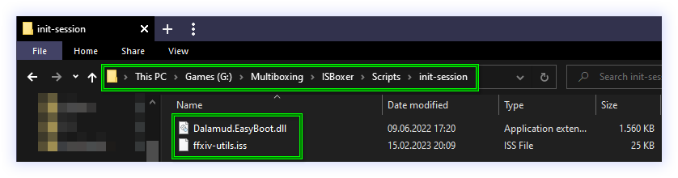

LavishScript scripts put into this folder will automatically be executed once a session starts, so there is no need for you to add additional pre-startup or startup sequence entries in Inner Space.

Open `ffxiv-utils.iss` in a text-editor of your choice and make sure the value of the variable `injectDalamud` is set to `TRUE`. This configures the script to actually inject Dalamud once the FINAL FANTASY XIV game client is running within Inner Space.

You can ignore the rest of the settings for now.

Launch a character from your character set and log into the game. Upon zoning into the game world, you should see the Dalamud messages in your chat window.

As mentioned before, in this configuration Dalamud is operational but inputs in the GUI elements of Dalamud are not being recognized. This is due to the changes made on the ImGuiScene library with [this commit in mid 2022][imguiscene-goat-wndproc] that somehow ended up breaking the inputs while running within Inner Space.

If you want the inputs to work, you must ensure that every character has its own XIVLauncher/Dalamud data directory because the current workaround is replacing the DLL before loading Dalamud. Since the Dalamud assets are automatically being checked and updated by XIVLauncher during every start of the application, this operation will fail when multiple characters try to access a single data directory.

### II.II Troubleshooting

If you can see the Dalamud chat messages but executing `/xlplugins` shows no window, please check whether you have a post-processor like ReShade or GShade installed and remove the post-processor from the game's directory. This usually happens when a post-processor is installed as `dxgi.dll`.

If you suspect a problem, please set an in-game console hotkey in your character set via ISBoxer Toolkit:

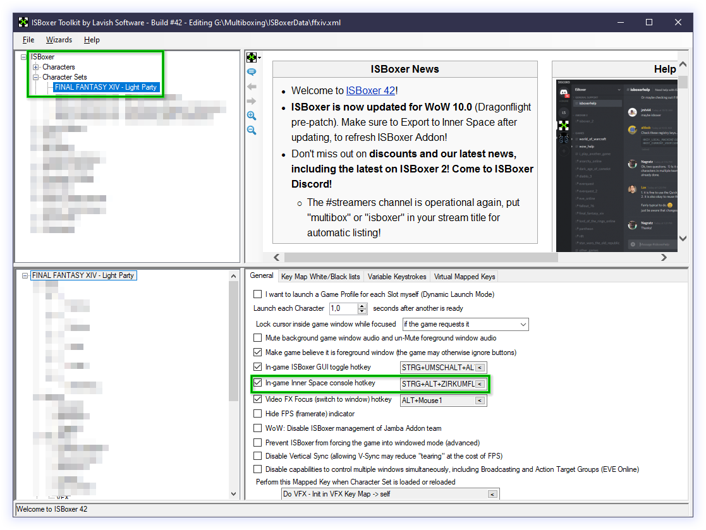

By bringing up the Inner Space console in-game, you can check whether the `ffxiv-utils.iss` script has ended prematurely due to a known error condition or everything looks good:

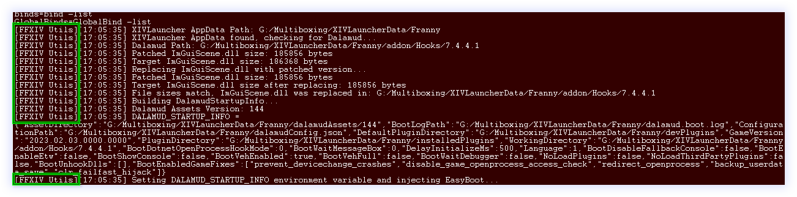
(This is a case of "looks good" because there are no messages beginning with `Error`)

You might need to scroll up a bit in the console before reaching the log messages prefixed `[FFXIV Utils]`. Error messages are prefixed with a clear `Error:` and should explain the reason.

If you cannot make heads or tails of the log, feel welcome to join the [ISBoxer Discord's][discord-isboxer] #final_fantasy_xiv channel where you can draw from the community's combined knowledge.

---

# Part III: Advanced Setup

Up to this point we have produced a clean and simple setup. But we want more flexibility and less caveats and less restrictions. We want to have individual configurations for XIVLauncher for every one of our characters. We want inputs in Dalamud. We do not want any limitations!

We want individual Dalamud configurations so databases or configuration files of plugins running at the same time across multiple characters do stay intact and separated from each other.

In the past we could have added three more XIVLauncher game profiles to Inner Space's FINAL FANTASY XIV configuration and used the command line argument `--roamingPath=C:/XIVLauncherData/character1` to specify the data directory for each character.

In fact, this still does work for XIVLauncher - but not for Dalamud. This is because XIVLauncher cannot be used to inject Dalamud anymore under Inner Space because that would trigger Inner Space to "lose" the game client, so the information about the data directory must be passed to Dalamud in a different way.

It is also a somewhat inelegant solution because changes to the XIVLauncher profile would need to be done multiple times instead of just having one single game profile.

This part of the guide will...
- Alter the startup sequence for XIVLauncher to enable the easy configuration of character-specific environment variables.
- Add support for the replacement of the ImGuiScene.dll to enable inputs in Dalamud while running within Inner Space.

### III.I Preparing a Replacement for XIVLauncher's Startup Sequence

One solution for an alternate startup sequence proposed by tsukasa is the "batch voodoo" solution.

It consists of one core file and a variable number of copies of another.

The general principle behind the batch voodoo is to call the central batch file `XIVLauncher.cmd` that contains details about the general paths and environment (i.e. the path that houses all character-specific data, the install location if XIVLauncher etc.).

The `XIVLauncher.cmd` then calls upon the `XIVLauncher-env.cmd`. We will configure this file to be virtualized in ISBoxer Toolkit to return a character-specific copy, thus allowing us to set variables on a per-character basis without having to add multiple game profiles in Inner Space.

The `XIVLauncher.cmd` will set an environment variable that will be picked up by the `ffxiv-utils.iss` we set up earlier. If the environment variable is present and the directory exists, Dalamud will use this directory as its data directory, thus giving us the per-character separation we want. Otherwise, `ffxiv-utils.iss` will fall back on the regular data path in `%APPDATA%\XIVLauncher`.

To get started, we have to download the set of batch files we want to use as our alternate startup sequence. You can grab the [latest version from GitHub][tsukasa_batch_files] by following the link, clicking on the green `Code` button in the upper right corner and selecting `Download ZIP`.

Extract the two files `XIVLauncher.cmd` and `XIVLauncher-env.cmd` to an empty directory (i.e. `G:\Multiboxing\XIVLauncherBatch`) that will only house the files, including their character-specific copies.

Please make sure that the directory does not contain any funny characters or spaces. A boring, short path works best.

Right-click the `XIVLauncher.cmd` and select `Edit`.

There is a large configuration block, however only one setting really _needs_ to be adjusted.

The only essential setting you _need_ to edit is the `ROAMINGPATH_ROOT` (Root directory for character/characterset-specific data). Set this path to point at an empty directory that will later house your character-specific data.

As with the directory for the two batch files, a boring, short path with no funny characters or spaces is recommended because the scripting has not been tested against the aforementioned scenarios.

For example, if you set it to `G:\Multiboxing\XIVLauncherData` and intend to use the characters `Lax`, `MiRai`, `altbob` and `Svpernova09`, upon starting each character a corresponding new folder will be created within `XIVLauncherData` so that you would end up with `[...]\XIVLauncherData\Lax`, `[...]\XIVLauncherData\MiRai`, `[...]\XIVLauncherData\altbob` and `[...]\XIVLauncherData\Svpernova09`.

Save the file and close it.

Now start ISBoxer Toolkit, navigate to `ISBoxer - Virtual Files`, right-click the `Virtual Files` node and select `New Virtual File` from the context menu. Name the file `XIVLauncher-env.cmd`.

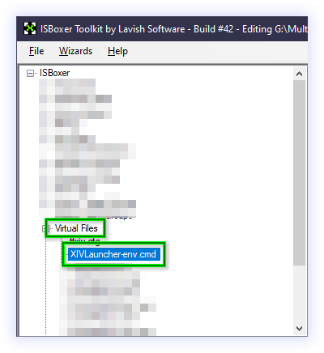

Select your first character from `ISBoxer - Characters - CHARACTER NAME`, select the `Virtual Files` node in the lower treeview and enable the `XIVLauncher-env.cmd` from the list.

Repeat this for all relevant characters.

Now select the first character again and go to `ISBoxer - Virtual Files - XIVLauncher-env.cmd` in the lower treeview. Virtualize the file as `XIVLauncher-env-CUSTOMNAME.cmd` where `CUSTOMNAME` is a string (i.e. the first name of the character without any special characters or spaces).

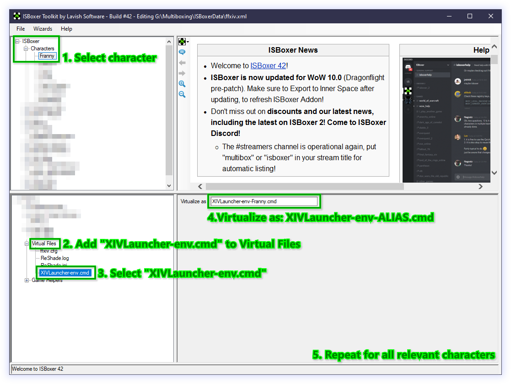

The file name must follow this static schema because the character name will be extracted from it, prepended character names or completely different filenames break the mechanism.

You _can_ make those work if you know your way around batch files, however for the sake of this guide we will keep it as simple as possible.

Repeat these steps for all other relevant characters.

Switching back to the file manager, now we create copies of the `XIVLauncher-env.cmd`. We copy the file and paste it in the same directory as `XIVLauncher.cmd` and the original `XIVLauncher-env.cmd` and rename it to `XIVLauncher-env-CUSTOMNAME.cmd`, where `CUSTOMNAME` is the name of a file we specified for one of our characters in ISBoxer Toolkit.

We repeat this step for all relevant characters (i.e. `XIVLauncher-env-Lax.cmd`, `XIVLauncher-env-MiRai.cmd`, `XIVLauncher-env-altbob.cmd` and `XIVLauncher-env-Svpernova09.cmd`).

This will force `cmd.exe` to redirect the execution of `XIVLauncher-env.cmd` to one of our character-specific files if we launch this character through Inner Space. The batch file itself will be able to determine its own name and set the character name which will then be picked up by `XIVLauncher.cmd` to build its arguments and environment variables.

The last step is to actually alter our XIVLauncher game profile for FINAL FANTASY XIV in Inner Space. For this, we right-click the Inner Space tray icon, select `Configuration`, navigate to the `Game Configuration` tab, select `FINAL FANTASY XIV` from the game list and select the `FINAL FANTASY XIV XIVLauncher Profile` from the game profile list.

We should be presented with the very dialogue we initially started with, showing us our `Main executable filename` as `XIVLauncher.exe` and our `Main executable path` as whatever we have set it to before:

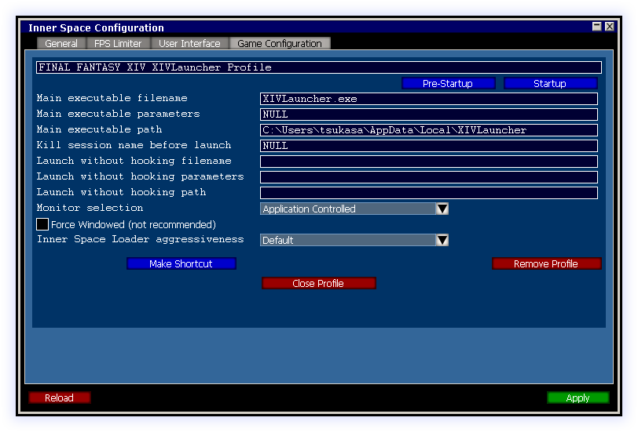

We adjust the `Main executable filename` to `XIVLauncher.cmd` and set the `Main executable path` to whatever directory we have extracted the two batch files to.

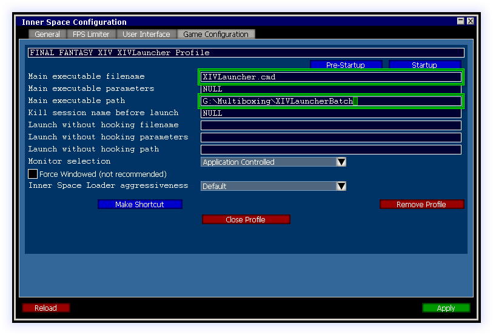

We click `Apply` to save the changes, `Close Profile` to close the dialogue and `Reload` to propagate the settings in Inner Space.

Then we proceed to start a character from our character set. Instead of bringing up the XIVLauncher main window, the launcher should guide us through its first-time configuration wizard where we have to specify the game path, language, DirectX version to use and whether we want to enable Dalamud.

This should be the case for all of our characters. We should also find that in our configured path (i.e. `G:\Multiboxing\XIVLauncherData`) we now find folders corresponding to our character names.

If you are missing a character name or XIVLauncher did not jump into the first-time configuration wizard, please check the steps.

Otherwise, your XIVLauncher and Dalamud data directories are now successfully set on a per-character basis.

You can verify this by logging into the game client and checking the Inner Space in-game console. You will see that `ffxiv-utils.iss` picks up the character-specific path.

### III.II Enabling ImGuiScene Replacement

As noted earlier, inputs in Dalamud's ImGui are not processed while running under Inner Space. As a workaround, `ffxiv-utils.iss` can replace the `ImGuiScene.dll` with a patched copy that reverts the offending commit that broke the function.

To enable this feature, we must download the [patched ImGuiScene.dll][imguiscene-patched-dll] and put it in ISBoxer's `Scripts/init-session` folder, right where the `ffxiv-utils.iss` and `Dalamud.EasyBoot.dll` already exist. The source-code for the patched ImGuiScene.dll [is available on GitHub][imguiscene-patched-source] for you to review.

Now we can edit the `ffxiv-utils.iss` in a text-editor and change the value of the variable `replaceImGuiSceneDll` in the configuration block, setting its value from `FALSE` to `TRUE`.

Once the game client has launched, the `ImGuiScene.dll` in your character's `addons/Hooks/*.*.*.*` folder should automatically get replaced with the patched copy from the `init-session` folder.

This will re-enable inputs in Dalamud.

---

[dalamud-easyboot-dll-source]: https://github.com/LaxLacks/Dalamud
[dalamud-easyboot-dll]: /assets/Dalamud.EasyBoot.dll
[discord-isboxer]: https://discord.gg/ESxEzhs
[ffxiv_dx9_eol_lodestone]: https://eu.finalfantasyxiv.com/lodestone/news/detail/46f28ce6bd697e3fd08e0e70c3c7646e5f5a3385
[ffxiv-utils-iss]: /scripts/ffxiv-utils.iss
[imguiscene-patched-dll]: /assets/ImGuiScene.dll
[imguiscene-patched-source]: https://github.com/tsukasa/ImGuiScene
[imguiscene-goat-wndproc]: https://github.com/goatcorp/ImGuiScene/commit/83de2a3d4f4b52ab05ec161dc08c915f07f3f3e0
[tsukasa_batch_files]: https://github.com/tsukasa/isboxer_ffxiv_batch
[unsteam_iss_script]: /scripts/unsteam.iss
[xivlauncher_github]: https://github.com/goatcorp/FFXIVQuickLauncher
